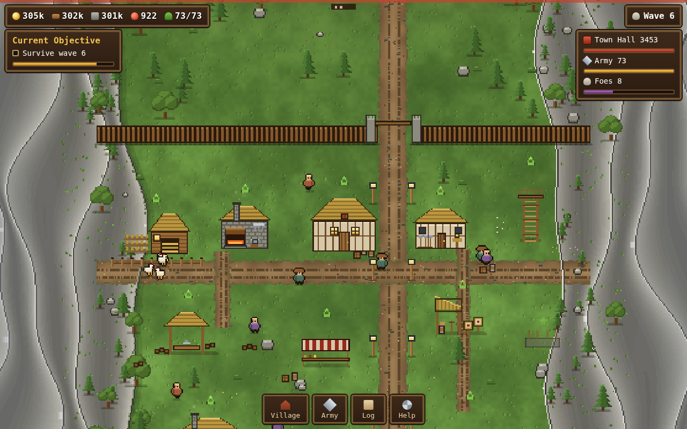
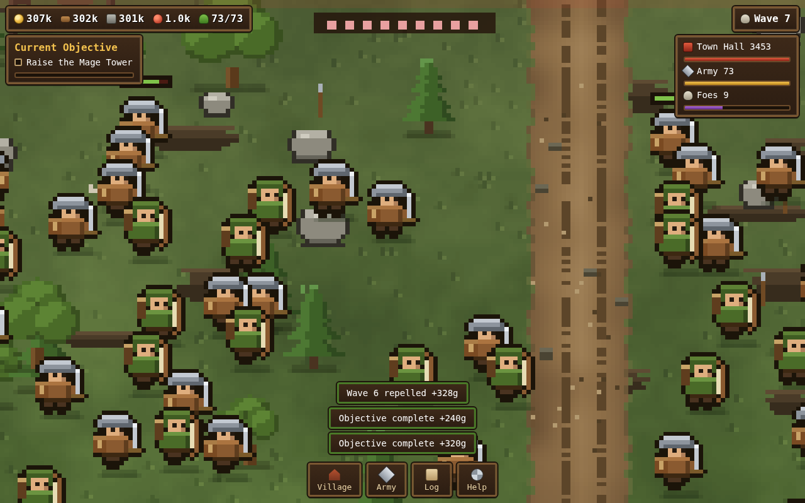

# Ironvale

A pixel-art village builder welded to an endless auto-battler. Your village sits
at the south end of the valley; the horde comes from the north. Upgrade buildings
to raise and arm an army that marches out on its own and holds the line — wave
after wave, forever.

**No build step, no dependencies.** It is plain HTML, CSS and ES modules.

| Tier I — thatch and timber | Tier V — stone, tile and banners |
|---|---|
|  |  |

*The same village, same camera. Every building rebuilds its art every 5 levels.*

## Running it

Because it uses ES modules, it needs to be served over HTTP rather than opened
from the filesystem. Any static server works:

```bash
python3 -m http.server 8000
# then open http://localhost:8000
```

The repo also ships a GitHub Pages workflow. To get a public URL, go to
**Settings → Pages** and set **Source** to **GitHub Actions** — the next push to
`main` publishes the game automatically.

## How it plays

**Drag** to pan. **Wheel** zooms toward the cursor, **pinch** does the same on a
touchscreen, and `+` / `−` / `0` zoom in, out and back to default. `WASD` and the
arrow keys pan, `Shift`+wheel scrolls without zooming, and `Space` snaps between
the village and the front line.

| Zoomed out — the whole valley | Zoomed in — the front line |
|---|---|
|  |  |

**Buildings have unlimited levels and rebuild their architecture every 5 levels.**
A thatched timber hut becomes a stone hall, then a tiled and bannered one, then a
gold-trimmed one — five distinct tiers of art per building, all drawn
procedurally. A green chevron floats over anything you can currently afford.

The **Town Hall** caps every other building at its own level + 5, so it is the
bottleneck you keep returning to. It is also the thing the horde is trying to
smash: when its HP reaches zero the run ends, your buildings survive, and the
waves restart from 1.

You never control troops directly. The Barracks, Archery Range and Mage Tower
train them on a timer, they walk out through the gate themselves, and they hold a
line north of the wall. Your levers are which buildings you feed:

| Building | What it does |
|---|---|
| Barracks | Militia, and armoured Knights from level 8 |
| Archery Range | Archers — out-range everything until the shamans arrive |
| Mage Tower | Splash damage; needs Town Hall 6 before it can be raised |
| Blacksmith | Flat attack + health multiplier on the whole army |
| Watchtower | Shoots anything that reaches the palisade |
| Farm | Troops eat. At zero food the army fights at 60% |
| Lumber Camp / Quarry / Market | Wood, stone and gold income |
| Tavern | Population cap and a cut of all gold |

Waves scale quadratically through the first 30, so the early game stays readable,
then pick up a mild exponential tail — troop power compounds with building levels,
so without that an optimal player would simply never lose again. Your population
is also capped at 160, which is what eventually lets the horde outgrow you. An
Ogre joins every fifth wave, and a second one every 25 waves after that.

Progress saves to `localStorage` automatically. Resources accrue while you are
away (capped at 8 hours), but waves only run while you are watching.

## Layout

```
index.html            markup + HUD chrome
style.css             panel / toolbar / sheet styling
src/
  config.js           EVERY tuning number — costs, curves, troop and foe stats
  state.js            game state, derived stats, save / load / offline catch-up
  main.js             boot, game loop, defeat handling
  input.js            camera drag / wheel / keys, building picking
  render.js           camera, depth sorting, the draw call
  art/
    prims.js          pixel primitives + material palettes
    buildings.js      procedural building art, one renderer per building × tier
    units.js          troop, foe and villager sprites
    terrain.js        one-off world generation (ground, roads, mountains, palisade)
  sim/
    economy.js        production, upkeep, troop training
    combat.js         waves, targeting, projectiles, damage, deaths
    village.js        ambient villagers and hens
```

### Notes for changing things

- **All balance lives in `src/config.js`.** Nothing else hardcodes a number.
  `waveHp` / `waveDmg` / `waveCount` are the difficulty curve; `costFor` and each
  building's `base` + `mul` are the economy. The two dials that decide how the
  whole game feels are `RATE_MUL` (how fast income compounds) and `TROOP_MUL`
  (how fast army power compounds) — they are deliberately close to the buildings'
  cost multipliers, which is what keeps payback time per level roughly flat.
  `LATE_FROM` is where the exponential tail starts biting.
- **Art is procedural, not sprite sheets.** `src/art/buildings.js` has one
  function per building that takes `(g, x, y, w, h, tier)` and composes walls,
  roofs, windows and trim from `prims.js`. That is what makes five visual tiers
  per building affordable — and why adding a sixth is a couple of `if (t >= 6)`
  lines rather than a new asset.
- Rendering happens on a **400 px logical grid at zoom 1**, scaled up with
  smoothing off. Zooming changes the logical width (`BASE_W / zoom`) rather than
  scaling the output, so pixels stay crisp at every level. The logical *height*
  follows the window aspect, so the picture always fills the screen.
- `applyViewport()` resizes the canvas **and** recomputes `VP` together. They
  must stay in lockstep — drawing at a size the backing store does not have
  leaves the previous frame visible around the edges.
- Terrain is generated once into a canvas padded by `TERRAIN_PAD` each side, so
  zooming out past the valley shows more mountain instead of blank canvas.
- The ground and the flanking rock are painted in a single `putImageData` pass
  off precomputed colour tables. Per-pixel `fillRect` with hex-string mixing
  cost seconds; this is ~50ms.
- Building sprites are cached per `(id, tier)` and invalidated on upgrade;
  animated bits (forge glow, chimney smoke, the mage tower's orb) are drawn live
  on top in `buildingFx`.
- Coordinates come in two flavours and mixing them up is the bug you will hit:
  **world** Y (0 at the horde's camp, 910 at the back of the village) and
  **screen** Y (`world - camera`). `pick()` and every `draw*` helper take screen Y.
- `window.IV` is exposed in the browser console: `IV.S` is live state and
  `IV.ff(seconds)` fast-forwards the simulation, which is how the balance above
  was checked.

## Not built yet

- No prestige layer — a defeat restarts the waves but keeps everything, so very
  long runs eventually plateau against the wave curve.
- The balance above was tuned against a scripted player (`IV.ff` plus `IV.upgrade`
  in a loop): roughly wave 14 at 10 minutes, wave 37 and tier III at 30 minutes,
  wave 78 and tier IV at 70 minutes, holding 60fps with 110+ troops on screen.
- Troops have no formation or targeting orders; positioning is emergent.
- No audio.
- The Google Font is loaded non-blocking on purpose (`media="print"` then
  swapped on load). A hanging stylesheet also delays deferred module scripts —
  that cost 13 seconds of startup on a network that could not reach Google.
- Enemy variety stops at five types; the wave table in `config.js` is where more
  would go.
